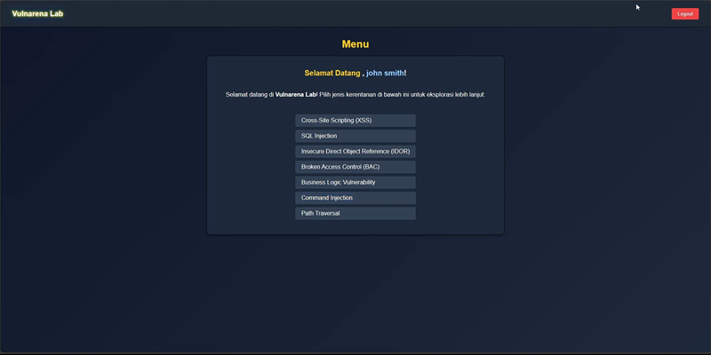

# Vulnarena

## Table of Contents

- [Project Overview](#vulnerability-arena)
- [Features](#features)
- [Demo](#demo)
- [Tech](#tech)
- [Documentation Structure](#documentation-structure)
- [Project Status](#project-status)
- [License](#license)
- [FAQ](#faq)
- [Contact](#contact)

---
## Vulnerability Arena

**Vulnarena** is a prototype interactive website designed as an educational cybersecurity platform, originally developed as a final project (skripsi).

Vulnarena is a uniquely complex open-source platform that brings together interactive cybersecurity learning, dynamic lab automation (with Kubernetes orchestration), and real-time PvP quiz—all in a single, modular system.  
It is developed fully with native PHP (no frameworks), alongside HTML, CSS (Tailwind), and JavaScript.
Such an integrated feature set is rarely found in academic or open-source projects, making Vulnarena a distinctive and valuable resource for both learners and developers.

Vulnarena is the only open-source platform (so far) that combines:
- **Interactive learning modules and post-test**
- **Auto-generated dynamic labs for every user with automated cleanup**
- **Real-time PvP quiz (Kahoot-style) with unique 1v1 matchmaking, MMR, and detailed match history**

All features are designed for practical, hands-on cybersecurity learning—no more theory-only!  
Labs are isolated (1 pod per user), and auto-delete keeps resources clean.  
PvP battles bring the excitement of real competition and learning at once.

---

## Features

- **Learning Materials & Post-Test:**  
  Access interactive cybersecurity content, then test your overall understanding with a comprehensive post-test covering all topics.

  
  > *Learning Material List*
  
  
  > *Example of Learning Material*
  
  
  > *Post-Test Feature*

- **Dynamic Vulnerable Labs:**  
  Practice hands-on in real, intentionally vulnerable lab environments for practical learning.

  
  
  *Lab Generator Page*
  
  
  
  *Dynamic Lab Menu*

- **PvP Quiz Mode:**  
  Compete live against other users in a cybersecurity quiz game inspired by Kahoot.
   
  *PvP Quiz*
  
   
  *PvP Result*
  
   
  *PvP Summary*

- **PvP Match History & MMR:**  
  View your quiz battle history, including win/loss stats and MMR record.

  
  *PvP History Page*

- **User Account Management:**  
  Register, log in, edit your profile, change or recover your password—all essential features are included.

  
  *User Accoung Management Page*

- **Modern UI & UX:**  
  The platform includes a clean and functional user interface and user experience, designed for effective and comfortable learning.

  .png)
  *Dashboard Page (Long Version)*

> **Note:**  
> The images above are a bit blurry due to limited source quality.  
> For a clearer view, please watch the demo video in the [Demo](#demo) section below.

---

## Demo

_Watch the demonstration video on YouTube_

---

## Tech

This website is built **fully with native PHP (no frameworks)**, HTML, CSS (Tailwind), and JavaScript, all running inside a Minikube-based infrastructure.

The platform follows a **decoupled architecture**:  
- The user-facing website (frontend) and the backend API server are fully separated, each running on different subdomains and isolated at the pod level in Kubernetes.
- The database service is also deployed as a separate pod.

For the **dynamic lab**, each user's lab environment is fully isolated using Kubernetes namespaces. Since each lab instance is intentionally vulnerable, a dedicated pod is created per user to ensure complete isolation—so one user cannot affect another user's lab.

The codebase is written to be as clear, modular, and easy to understand as possible—especially the API, which uses native PHP with custom-built middleware and routing.

The frontend aims to provide a smooth and modern user experience, using JavaScript for interactivity and Tailwind CSS for a clean design.

### Backend API Composer Packages

The backend API uses three main Composer packages:
- **PHPMailer** — Sends OTP emails for registration and password reset.
- **K8S PHP Client** — Manages the creation and deletion of dynamic labs for users via Kubernetes (including automated cleanup using cronjobs).
- **Ratchet** — Implements the real-time WebSocket server for the PvP quiz feature.

---

## Documentation Structure

> This repository is not plug & play. Each part must be set up individually as described in the respective README files.

Each core module/service has its own README with specific setup and usage instructions:
- [Backend/API Setup](./apps/web/backend/README.md)
- [Frontend/Web Setup](./apps/web/frontend/README.md)
- [Lab Environment](./apps/lab/README.md)
- [Infrastructure/Deployment](./infrastructure/README.md)

> Please refer to each module’s README before attempting to run or modify the code.

---

## Project Status

This repository is released as an **open-source reference only**.  
There are **no plans for further development or maintenance**.  
The code is provided as a learning resource and example implementation for anyone interested in cybersecurity education platforms.

**Pull requests and external contributions will not be accepted.**  
Feel free to fork, explore, and modify this code for your own learning or future projects.

---

## License

This project is licensed under the [MIT License](LICENSE).

© 2025 Muhammad Luthfi Dwi Anggana, Anniki Reynara Iskandar, Ayubi Sholahudin.

> **Notice:**
> Vulnarena is not intended for large-scale production.  
> This project is for educational and reference purposes only.
> It is **not intended for production use** and may lack certain security and scalability features.  
> Some measures—such as rate limiting, advanced pentesting, or massive user load balancing—have not been fully implemented or tested, as this project was developed as an academic prototype.
>
> Some comments in the code are written in Bahasa Indonesia.  
> You may translate them to English if needed.  
> The website interface itself is in Bahasa Indonesia, but you are welcome to modify it as you wish.

---

## FAQ

### Q: Is there an installation or setup guide?
**A:**  
No, Vulnarena is not a plug-and-play template.  
It is a fully developed prototype, and setting it up requires significant customization to match your own infrastructure (such as Minikube/Kubernetes cluster, domains, credentials, etc).  
We recommend exploring the codebase and reading the README.md files in each directory to understand the project structure.  
You are encouraged to adapt the code as needed for your environment.

### Q: What are the minimum requirements?
**A:**  
There is no strict minimum requirement provided.

Vulnarena uses containerized deployments (via Kubernetes/Minikube), so you do **not** need to install specific versions of PHP, MySQL, or other dependencies on your host machine.  
You only need a working Kubernetes (Minikube) or similar container orchestration environment, with enough resources to run multiple pods and services.

Generally, you should have:
- Basic knowledge of Docker, orchestration, and Kubernetes
- Sufficient compute resources to deploy multiple containers/pods

All other requirements are handled by the deployment manifests in the repository.  
Exact resource needs may vary depending on your deployment setup.  
You are expected to adjust and configure resources as necessary.

### Q: Can I use Vulnarena for my own project or in production?
**A:**  
You are welcome to fork and modify the code for learning or further development.  
However, **Vulnarena is not intended for production use** and may lack certain security and scalability features.

### Q: I found a bug or severe vulnerability. Can I send a pull request to fix this issue?
**A:**  
Pull requests and external contributions will not be accepted, as this repository is provided for reference only.  
You are welcome to keep your findings for yourself or share them with the community as you see fit.

---

## Contact

Discord: **4.dmin**
